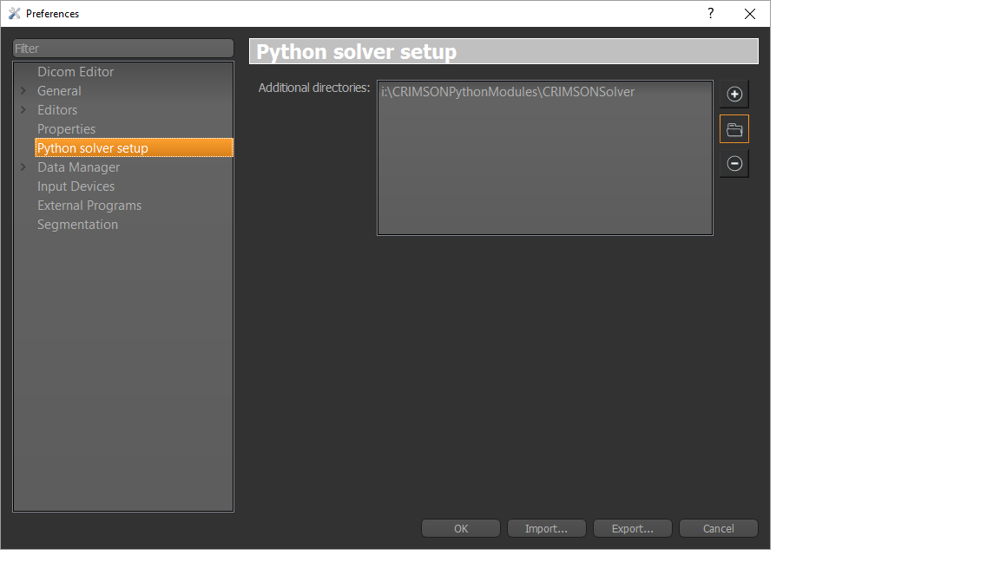

***************
Getting started
***************

To create your own python-based module which allows CRIMSON to communicate with your particular solver,
you first need to familiarize yourself with the :ref:`concepts` that CRIMSON uses for the description of the 
computational domain and the solver setup entities (such as boundary conditions). Once you have a clear
understanding of these concepts, proceed to the next section. 

Creating blank CRIMSON python module
------------------------------------

The easiest way to get started with the CRIMSON python module development is to use a CRIMSONModuleTemplate to generate
a useful module skeleton which can then be populated with functional code. To use the module template, you need to:

 - Download and extract the `CRIMSONModuleTemplate <https://umich.box.com/shared/static/iwpqj9eogasmic8mr131ixk0juteqk6g.zip>`_ package
 - Install `python 2.7 <https://www.python.org/downloads/release/python-2711/>`_ (if you don't have it already)
 - Use python's ``pip`` command to install the ``pystache`` package. To do this, execute the following command from your terminal::
 
        pip install pystache
        
 - Edit the last line of ``createCRIMSONModule.py``, which is located in the directory you extracted CRIMSONModuleTemplate to,
   to specify the boundary condition, solver setup and solver study names you want the script to create for you. For example::
   
        createCRIMSONModule('CRIMSONSolver', 'CRIMSONSolverSolverSetupManager', ['RCR', 'NoSlip'], ['SolverSetup3D'], ['CRIMSONStudy3D'])
   
   Note, that the names should be valid python identifiers (e.g. they cannot contain any spaces)
   
 - Run the python script::
 
        python createCRIMSONModule.py
        
 - You can now move the newly created directory (in this example it will be 'CRIMSONSolver') to your development directory (not necessary, but recommended)
   and start editing the code
 - To let CRIMSON know about the location of your module, open CRIMSON, go to the 'Window' menu, choose 'Preferences', choose 'Python solver setup', 
   and add the full path of the directory you created to the 'Additional directories' list. Note that this should be done once and it will be saved
   until a new version of CRIMSON is installed.
   

Tips and tricks
---------------

During development, it is useful to know if anything went wrong during the execution of your python code.
To see the output of the built-in python interpreter, you can either look at the CRIMSON console window,
or you can open the Python view and the interpreter output will be duplicated in that view. 

It is recommended to create a very small lightweight scene, so that loading it
can be done very quickly. In some cases, calling :mod:`PythonQt.CRIMSON.Utils.reloadAll() <PythonQt.CRIMSON.Utils>` is not enough
to ensure that no old code remains in the system. In this case, reloading the scene is a very simple way to
make sure of that. 

   
 
        