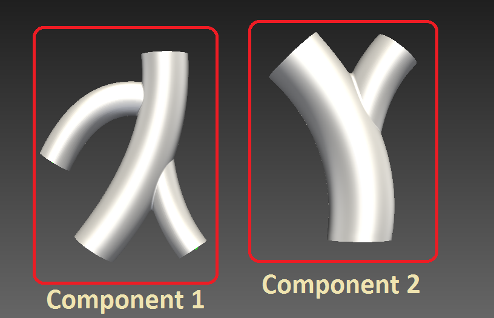
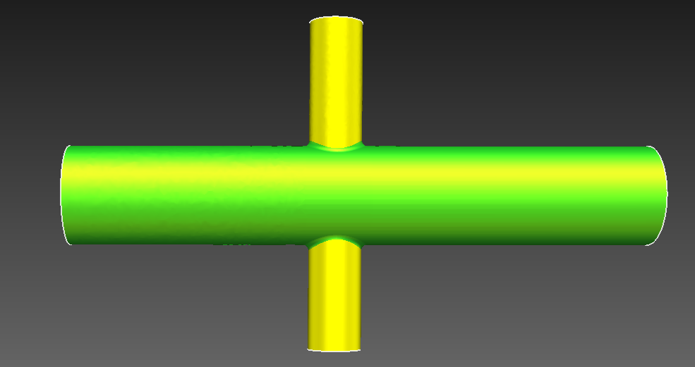

.. _concepts:

********
Concepts
********

There are several basic concepts that CRIMSON uses to allow specification of the simulation setup:

* Vessel tree
* Geometric model
* Simulation mesh
* Solver setup manager
* Boundary condition
* Boundary condition set
* Material
* Solver setup
* Solver study

.. _vessel-tree:

Vessel tree
===========

A vessel tree contains the information about the vessels and which vessels form connected components.

A vessel tree is passed to the ``setupSolver`` method of a solver study and has the following API:

``getActiveConnectedComponentsMap()``
    Returns a ``dict`` object mapping from UIDs of vessels (as used by :mod:`face identifiers <CRIMSONCore.FaceIdentifier>`)
    to the connected component index. This means that all vessels having the same connected component index form a single
    connected simulation domain.

|

``getClosestPoint(faceIdentifier, x, y, z)``
    Returns the distance to arc length along the vessel path defined by the ``faceIdentifier`` to the point at coordinates ``(x, y, z)``.

.. _geometric-model:

Geometric model
===============

Geometric model describes the boundary of the simulation domain. Currently, the geometric model in CRIMSON is described using
a set of planar or B-spline *faces* that are created during model building. Each face has a :mod:`face identifier <CRIMSONCore.FaceIdentifier>` defining it.
The face identifiers for the models created in CRIMSON (i.e. not imported from external solid modelling tool) are preserved
through model modification, e.g. re-lofting, changing the fillet size, or adding extra vessels will not affect the face identifiers and
boundary conditions attached to these faces.

Note, that multiple *physical* model faces may share the same *logical* face identifier.
For example, in the image below, two physical faces in yellow share the same face identifier because they were created from the wall of the same vessel.

A geometric model is passed to the ``setupSolver`` method of a solver study and has the following API:

``getModelFacesForFaceIdentifier(faceIdentifier)``
    Returns a list of model face indices that share the face identifier ``faceIdentifier``.

``getFaceIdentifierForModelFace(index)``
    Returns the face identifier for the model face index ``index``.

``getNumberOfModelFaces()``
    Returns the total number of model faces.

``getNumberOfFaceIdentifiers()``
    Returns the total number of face identifiers.

``faceIdentifierIndex(faceIdentifier)``
    Returns an index of a face identifier in a list of unique face identifiers. The returned value is in range ``0 <= index < getNumberOfFaceIdentifiers()``.
    Note, that the returned indices may change after model modification.

``getFaceIdentifier(index)``
    Returns the face identifier that has the index ``index`` in the list of unique face identifiers.

``getFaceNormal(faceIdentifier)``
    Returns a list of three ``float``s representing the normal for a face associated with the ``faceIdentifier``. Note, that the return value will only be valid for flat (inflow/outflow) faces.
    For wall faces, returns ``[0, 0, 0]``.

``getDistanceToFaceEdge(faceIdentifier, x, y, z)``
    Returns the distance to the edge of the face associated with the ``faceIdentifier`` to point at position ``[x, y, z]``.
    The result will only be correct for flat (inflow/outflow) faces that have not been split into multiple model faces
    (i.e. ``getModelFacesForFaceIdentifier(faceIdentifier)`` returns a list of length 1).

.. _simulation-mesh:

Simulation mesh
===============

Simulation mesh describes the subdivision of the simulation domain into small discrete elements suitable for
finite element simulation.

A 3D simulation mesh consists of nodes (or vertices), edges, faces and elements.

A simulation mesh is passed to the ``setupSolver`` method of a solver study and has the following API:

``getNNodes()``
    Returns the number of nodes in the mesh.

``getNEdges()``
    Returns the number of edges in the mesh.

``getNFaces()``
    Returns the number of faces in the mesh.

``getNElements()``
    Returns the number of elements in the mesh.

``getNodeCoordinates(nodeIndex)``
    Returns a list of three ``float``s representing the node position.
    ``nodeIndex`` should be in the range ``0 <= nodeIndex < getNNodes()``.

``getElementNodeIds(elementIndex)``
    Returns a list of node indices for element with index ``elementIndex``.
    ``elementIndex`` should be in the range ``0 <= elementIndex < getNElements()``.

``getAdjacentElements(elementIndex)``
    Returns a list of element indices that the element with index ``elementIndex`` shares a face with.
    ``elementIndex`` should be in the range ``0 <= elementIndex < getNElements()``.

``getNodeIdsForFace(faceIdentifier)``
    Returns a list of node indices for all model faces with face identifier ``faceIdentifier``.
    Note, that node indices on the face edges are shared for edges between different faces
    belonging to the wall (:mod:`FaceType.ftWall <PythonQt.CRIMSON.FaceType>`). However, for the edges between cap faces
    (:mod:`FaceType.ftCapInflow <PythonQt.CRIMSON.FaceType>` and :mod:`FaceType.ftCapOutflow <PythonQt.CRIMSON.FaceType>`)
    and wall faces, nodes at the edge always belong to the wall (i.e. for flow faces, the nodes at the edge will not
    be included in the list returned by this function).

``getMeshFaceInfoForFace(faceIdentifier)``
    Returns a list of face information lists for all model faces with face identifier ``faceIdentifier``.
    Each element of the returned list contains the following information::

        [0] elementIndex - element index that the mesh face belongs to
        [1] faceIndex    - face index
        [2] nodeIndex    - index of the first node
        [3] nodeIndex    - index of the second node
        [4] nodeIndex    - index of the third node

.. _solver-setup-manager:

Solver setup manager
====================

Solver setup manager contains the information about other entities necessary for solver setup, their human-readable names,
as well as the ways to create these entities.

A solver setup manager class is expected to implement the following interface:

``getBoundaryConditionSetNames()``
    Return a list of strings containing the names of types of boundary condition sets that the user can choose from.

``createBoundaryConditionSet(name)``
    Return an object of boundary condition set class for the boundary condition set type ``name``.
    ``name`` will be chosen from the list returned by ``getBoundaryConditionSetNames()``.

``getBoundaryConditionNames()``
    Return a list of strings containing the names of types of boundary conditions that the user can choose from.

``createBoundaryCondition(name)``
    Return an object of boundary condition class for the boundary condition type ``name``.
    ``name`` will be chosen from the list returned by ``getBoundaryConditionNames()``.

``getSolverSetupNames()``
    Return a list of strings containing the names of types of solver setups that the user can choose from.

``createSolverSetup(name)``
    Return an object of solver setup class for the solver setup type ``name``.
    ``name`` will be chosen from the list returned by ``getSolverSetupNames()``.

``getSolverStudyNames()``
    Return a list of strings containing the names of types of solver studies that the user can choose from.

``createSolverStudy(name)``
    Return an object of solver study class for the solver study type ``name``.
    ``name`` will be chosen from the list returned by ``getSolverSetupNames()``.

``getMaterialNames()``
    Return a list of strings containing the names of types of materials that the user can choose from.

``createMaterial(name)``
    Return an object of material class for the boundary condition type ``name``.
    ``name`` will be chosen from the list returned by ``getBoundaryConditionNames()``.

.. _boundary-condition:

Boundary condition
==================

Boundary condition represents a single boundary condition applied to the part of the simulation domain boundary.
It is recommended to inherit the specific boundary condition classes from :mod:`CRIMSONCore.FaceData` and fill
in the properties in the boundary condition class' constructor.

In addition to the properties exposed to the user through the :mod:`CRIMSONCore.PropertyStorage`,
the boundary condition can also define a method `createCustomEditorWidget`. This function will be called
by the C++ code when the user intends to edit the boundary condition. It should return a Qt widget
which can be created using the ``PythonQt.QtGui`` module. Note, that the ownership of the widget belongs to
the Python code and thus should be stored as a member of the boundary condition instance. However, it should not
be saved to the scene and thus the ``__getstate__`` and ``__setstate__`` methods should be overriden to avoid this.
Please see the implementation of ``CRIMSONSolver.BoundaryConditions.PrescribedVelocities`` class for a reference
implementation.

Furthermore, the boundary condition class must define a class-scope member variables ``unique`` and  ``applicableFaceTypes``.
The ``applicableFaceTypes`` is a list of :mod:`PythonQt.CRIMSON.FaceType` the boundary condition can be applied to.

An example implementation of a boundary condition::

    from CRIMSONCore.FaceData import FaceData
    from PythonQt.CRIMSON import FaceType

    class RCR(FaceData):
        unique = False
        humanReadableName = "RCR"
        applicableFaceTypes = [FaceType.ftCapInflow, FaceType.ftCapOutflow]

        def __init__(self):
            FaceData.__init__(self)
            resistancePropertyAttributes = {"suffix": u" g/(mm\u2074\u00B7s)", "minimum": 0.0}
            capacitancePropertyAttributes = {"suffix": u" mm\u2074\u00B7s\u00B2/g", "minimum": 0.0}
            self.properties = [
                {
                    "Proximal resistance": 100.0,
                    "attributes": resistancePropertyAttributes
                },
                {
                    "Capacitance": 1e-5,
                    "attributes": capacitancePropertyAttributes
                },
                {
                    "Distal resistance": 1000.0,
                    "attributes": resistancePropertyAttributes
                }
            ]

.. _material:

Material
==================

Material objects represent a single type of material applied to the part of the simulation domain boundary.
The faces that the material is applied to, its properties, the ``unique`` flag and custom editor widget behaviour are
identical to those of the boundary condition classes.

An example implementation of a material::

    from CRIMSONCore.FaceData import FaceData
    from PythonQt.CRIMSON import FaceType

    class DeformableWallMaterial(FaceData):
        unique = False
        humanReadableName = "Deformable wall material"
        applicableFaceTypes = [FaceType.ftWall]

        def __init__(self):
            self.properties = [
                {
                    "Young's modulus": 4661000.0,
                    "attributes": {"suffix": u" g/(mm\u00B7s\u00B2)", "minimum": 0.0}
                },
                {
                    "Thickness": 1.0,
                    "attributes": {"suffix": u" mm", "minimum": 0.0}
                },
            ]

.. _boundary-condition-set:

Boundary condition set
======================

Boundary condition set represents a set of logically related boundary conditions. This logical grouping facilitates
reuse of boundary conditions to simulate difference scenarios. Currently only used for boundary condition grouping
in the GUI. Thus, this class may be empty::

    class BoundaryConditionSet(object):
        def __init__(self):
            pass

.. _solver-setup:

Solver setup
============

Solver setup contains solver-specific values necessary to complete the simulation setup along with boundary conditions and the simulation mesh.
For example, these may include the number and size of a time step for the simulation or the output configuration.

It is recommended to inherit the specific solver setup classes from :mod:`CRIMSONCore.PropertyStorage`.

An example implementation of a solver setup::

    from CRIMSONCore.PropertyStorage import PropertyStorage

    class SimpleSolverSetup(PropertyStorage):
    def __init__(self):
        PropertyStorage.__init__(self)
        self.properties = [
            {
                "Time parameters": [
                    {
                        "Number of time steps": 200,
                        "attributes": {"minimum": 1}
                    },
                    {
                        "Time step size": 0.01,
                        "attributes": {"minimum": 0.0, "suffix": " s"}
                    }
                ]
            },
            {
                "Fluid parameters": [
                    {
                        "Viscosity": 0.004,
                        "attributes": {"minimum": 0.0, "suffix": u" g/(mm\u00B7s)"}
                    },
                    {
                        "Density": 0.00106,
                        "attributes": {"minimum": 0.0, "suffix": u" g/mm\u00B3"}
                    }
                ]
            },
        ]

.. _solver-study:

Solver study
============

Solver study contains information about associated simulation mesh, one or more boundary condition sets, and a solver setup,
and is responsible for preparing the input files to be used by the solver.
In addition, it is responsible for translating the resulting output of the simulation to the format used by CRIMSON.

A solver study class is expected to implement the following interface:

``setMeshNodeUID(uid)``
    Store the node uid of the simulation mesh (``string``).

``getMeshNodeUID()``
    Return the stored node uid of the simulation mesh (``string``).

``setSolverSetupNodeUID(uid)``
    Store the node uid of the solver setup (``string``).

``getSolverSetupNodeUID()``
    Return the stored node uid of the solver setup (``string``).

``setBoundaryConditionSetNodeUIDs(uids)``
    Store the node uids of the boundary condition sets (``list(string)``).

``getBoundaryConditionSetNodeUIDs()``
    Return the stored node uids of the boundary condition sets (``list(strings)``).

``writeSolverSetup(vesselTreeData, geometricModelData, meshData, solverSetup, boundaryConditions, vesselPathNames, solutionStorage)``
    Write the setup for the solver. The parameters are as follows:

    :``vesselTreeData``: a :ref:`vessel tree data <vessel-tree>` object (only present for models built in CRIMSON)
    :``geometricModelData``: a :ref:`geometric model data <geometric-model>` object.
    :``meshData``: a :ref:`simulation mesh data <simulation-mesh>` object.
    :``solverSetup``: a :ref:`solver setup  <solver-setup>` object.
    :``boundaryConditions``: a list of :ref:`boundary condition <boundary-condition>` objects.
    :``vesselPathNames``: a dictionary mapping the UID's used by :mod:`face identifiers <CRIMSONCore.FaceIdentifier>`
                          to the names that user has assigned to vessel paths that the user assigned in the GUI
                          (e.g. *Aorta*, *Left carotid*, etc.).
    :``solutionStorage``: a :mod:`solution storage <CRIMSONCore.SolutionStorage>` object containing the solution that
                          has been loaded using ``loadSolution`` or transferred to the new mesh during mesh adaptation.

``loadSolution()``
    Load the result of simulation. Should return an instance of :mod:`CRIMSONCore.SolultionStorage`.
